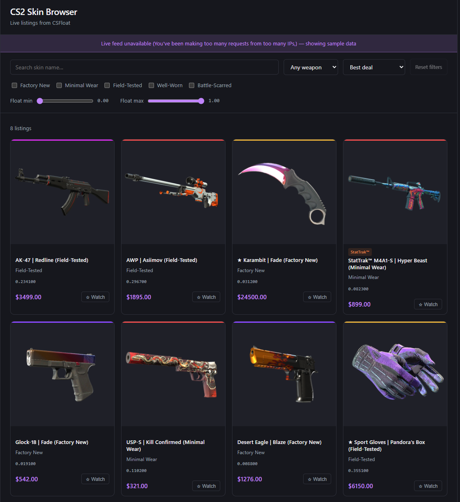

# CS2 Skin Browser

A React app for browsing live CS2 skin listings from the [CSFloat](https://csfloat.com) marketplace. Built as a portfolio project to demonstrate React, custom hooks, API integration, and CSS.



---

## Features

- **Live listings** — real buy-now listings pulled directly from the CSFloat API
- **Weapon filter** — dropdown to filter by weapon type (AK-47, AWP, Karambit, etc.)
- **Wear filter** — checkboxes for Factory New, Minimal Wear, Field-Tested, etc.
- **Float range slider** — set min/max float values to narrow down condition precisely
- **Sort** — best deal, newest, price or float (ascending/descending)
- **Reset filters** — one click back to the defaults
- **Skin name search** — instant client-side filtering by name within fetched results
- **Watchlist** — save listings with a single click; persists across page refreshes via `localStorage`
- **Rarity colour bar** — each card shows the skin's rarity colour (Consumer → Covert → Gold)
- **StatTrak™ / Souvenir badges** — labelled clearly on cards where applicable
- **Skeleton loading** — placeholder cards animate while listings are fetching
- **Dark mode** — respects the OS colour scheme preference

## Tech stack

| | |
|---|---|
| Framework | React 19 + Vite |
| Styling | Plain CSS with custom properties |
| Data | [CSFloat public API](https://csfloat.com/api) |
| Persistence | `localStorage` |
| Testing | Vitest + React Testing Library |

## Getting started

### 1. Get a CSFloat API key

Create a free account at [csfloat.com](https://csfloat.com), then go to **Account Settings → API** to generate a key.

### 2. Clone and install

```bash
git clone https://github.com/your-username/cs2-skin-browser.git
cd cs2-skin-browser
npm install
```

### 3. Add your API key

Create a `.env.local` file in `cs2-skin-browser/` (next to `package.json`):

```
CSFLOAT_API_KEY=your_api_key_here
```

> `.env.local` is gitignored. The key has no `VITE_` prefix on purpose: it is only read server-side (by the `/api/listings` function), so it is never bundled into the browser code. On Vercel, set `CSFLOAT_API_KEY` in the project's environment variables.

### 4. Run

```bash
npm run dev
```

Open [http://localhost:5173](http://localhost:5173).

## How it works

The `useSkinListings(filters)` custom hook manages all API communication:

- API calls are **debounced by 500 ms** so typing doesn't fire a request on every keystroke
- **Weapon filter** sends a `def_index` parameter to the CSFloat API (server-side)
- **Wear and float filters** send `min_float` / `max_float` (server-side)
- **Sort** sends `sort_by` (server-side)
- **Text search** is applied client-side on the returned listings — the CSFloat public API doesn't expose a text-search endpoint
- When a weapon is selected the hook fetches **50 listings**; otherwise **20**

The browser never talks to CSFloat directly. It calls `/api/listings`, a Vercel serverless function (`api/listings.js`) that adds the API key and forwards the request to `https://csfloat.com/api/v1/listings`. In development, a small Vite plugin runs that same function inside the dev server, so `npm run dev` is all you need.

To stay under CSFloat's limits, responses are cached at several levels: Vercel's edge cache (5 minutes), the function's own memory (which also serves the last good listings if CSFloat errors, and pauses calls for a minute after an error), and the browser (so switching filters back and forth doesn't refetch). Only known query parameters are forwarded, so random query strings can't bypass the cache.

If the live API fails (bad key, rate limit, outage), the app falls back to built-in sample listings. Filters and sorting still work on the sample data.

## Testing

```bash
npm test
```

29 tests with [Vitest](https://vitest.dev) and React Testing Library:

- **Filter logic** (`utils/listings.test.js`) — wear → float ranges, weapon/wear/float filters, sorting, search
- **App behaviour** (`App.test.jsx`) — renders the whole app with the API failing, then filters, searches, uses the watchlist and resets, the way a user would
- **Serverless function** (`tests/api-listings.test.js`) — against a fake CSFloat: parameter allow-list, caching, error cooldown, serving stale data
- **Sample data** (`data/sampleListings.test.js`) — every float matches its wear, every weapon in the dropdown is covered
- **Image URLs** (`utils/steamImage.test.js`)

Use `npm run test:watch` to re-run tests on save.

## Project structure

```
api/
  listings.js            # Vercel serverless function: adds the API key, caches, proxies CSFloat
cs2-skin-browser/tests/
  api-listings.test.js   # tests for api/listings.js
src/
  components/
    Header.jsx
    FilterPanel.jsx      # weapon dropdown, wear checkboxes, float sliders, search input
    ListingsGrid.jsx     # skeleton loader, result count, card grid
    SkinCard.jsx         # rarity bar, badges, watch button
    WatchlistPanel.jsx
  hooks/
    useSkinListings.js   # debounced fetch, filter → API param mapping
  utils/
    listings.js          # wear ranges, filtering, sorting, search (pure functions)
    steamImage.js        # Steam CDN image URLs
  data/
    sampleListings.js    # fallback listings (47, covering every weapon and wear)
  App.jsx
  index.css
```
