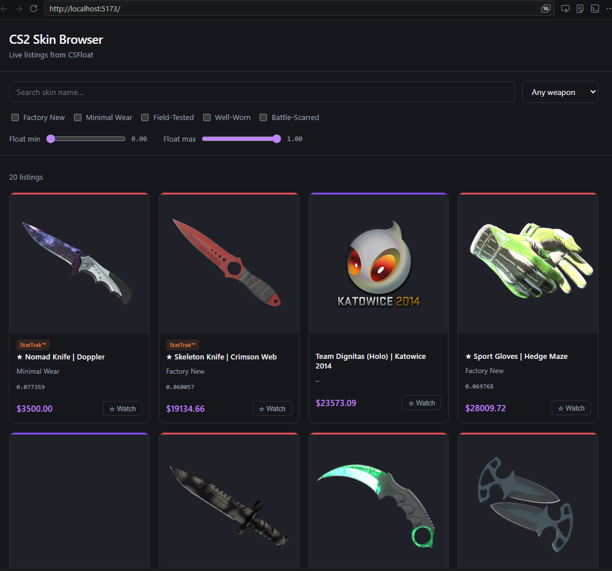

# CS2 Skin Browser

A React app for browsing live CS2 skin listings from the [CSFloat](https://csfloat.com) marketplace. Built as a portfolio project to demonstrate React, custom hooks, API integration, and CSS.



---

## Features

- **Live listings** — real buy-now listings pulled directly from the CSFloat API
- **Weapon filter** — dropdown to filter by weapon type (AK-47, AWP, Karambit, etc.)
- **Wear filter** — checkboxes for Factory New, Minimal Wear, Field-Tested, etc.
- **Float range slider** — set min/max float values to narrow down condition precisely
- **Skin name search** — instant client-side filtering by name within fetched results
- **Watchlist** — save listings with a single click; persists across page refreshes via `localStorage`
- **Rarity colour bar** — each card shows the skin's rarity colour (Consumer → Covert → Gold)
- **StatTrak™ / Souvenir badges** — labelled clearly on cards where applicable
- **Skeleton loading** — placeholder cards animate while listings are fetching
- **Dark mode** — respects the OS colour scheme preference

## Tech stack

| | |
|---|---|
| Framework | React 19 + Vite |
| Styling | Plain CSS with custom properties |
| Data | [CSFloat public API](https://csfloat.com/api) |
| Persistence | `localStorage` |

## Getting started

### 1. Get a CSFloat API key

Create a free account at [csfloat.com](https://csfloat.com), then go to **Account Settings → API** to generate a key.

### 2. Clone and install

```bash
git clone https://github.com/your-username/cs2-skin-browser.git
cd cs2-skin-browser
npm install
```

### 3. Add your API key

Create a `.env.local` file in the project root:

```
VITE_CSFLOAT_API_KEY=your_api_key_here
```

> `.env.local` is gitignored — your key will never be committed.

### 4. Run

```bash
npm run dev
```

Open [http://localhost:5173](http://localhost:5173).

## How it works

The `useSkinListings(filters)` custom hook manages all API communication:

- API calls are **debounced by 500 ms** so typing doesn't fire a request on every keystroke
- **Weapon filter** sends a `def_index` parameter to the CSFloat API (server-side)
- **Wear and float filters** send `min_float` / `max_float` (server-side)
- **Text search** is applied client-side on the returned listings — the CSFloat public API doesn't expose a text-search endpoint
- When a weapon is selected the hook fetches **50 listings**; otherwise **20**

The Vite dev server proxies requests to `https://csfloat.com` to avoid CORS in the browser:

```
/csfloat-api/v1/listings → https://csfloat.com/api/v1/listings
```

## Project structure

```
src/
  components/
    Header.jsx
    FilterPanel.jsx      # weapon dropdown, wear checkboxes, float sliders, search input
    ListingsGrid.jsx     # skeleton loader, result count, card grid
    SkinCard.jsx         # rarity bar, badges, watch button
    WatchlistPanel.jsx
  hooks/
    useSkinListings.js   # debounced fetch, filter → API param mapping
  App.jsx
  index.css
```